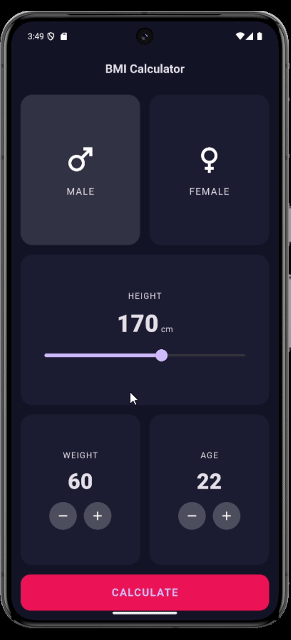
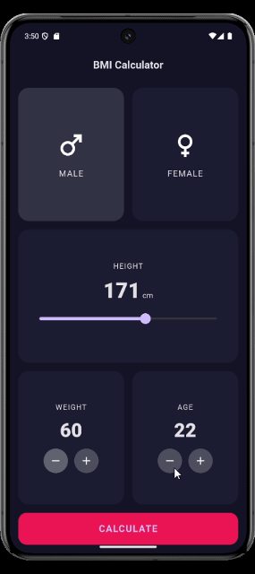

# BMI Calculator

A Flutter app that helps users calculate their Body Mass Index (BMI) from height and weight inputs, then displays a result category with guidance.

## Features

- Gender selection
- Height input with slider
- Age and weight controls
- Instant BMI calculation
- Result screen with BMI value, category, and interpretation

## Tech Stack

- [Flutter](https://flutter.dev/)
- [Dart](https://dart.dev/)

## Project Structure

```text
lib/
  main.dart              # App entry point
  splash_screen.dart     # Initial splash screen
  home_screen.dart       # Main input screen
  result_screen.dart     # BMI result view
  custom_app_bar.dart    # Reusable app bar widget
  gender_type.dart       # Gender selector widget
  heightCard.dart        # Height input widget
  age_and_weight.dart    # Age and weight input widget
```

## Getting Started

### Prerequisites

- Flutter SDK installed
- Dart SDK (included with Flutter)
- Android Studio / Xcode / VS Code (any Flutter-supported IDE)

### Installation

1. Clone the repository:
   ```bash
   git clone <your-repo-url>
   cd bmi_calculator
   ```
2. Install dependencies:
   ```bash
   flutter pub get
   ```
3. Run the app:
   ```bash
   flutter run
   ```

## Testing

Run widget tests with:

```bash
flutter test
```

## Demo




## License

This project is for educational/demo purposes.
